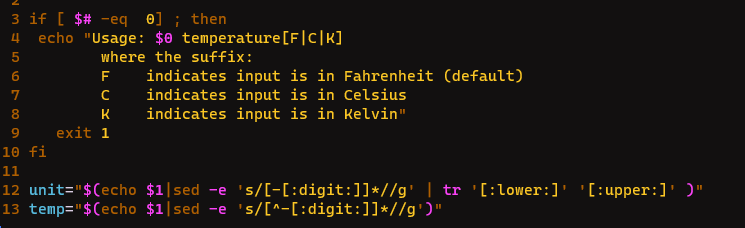

# Exam_2420

## Part 1

To update most of the software on your Ubuntu OS, you can run these commands:

    sudo apt update
    sudo apt upgrade

## Part 2

I first changed all the `eco`'s to `echo`

I used `/` to search `eco` navigated to past the c and then entered `a` to go into insert mode and entered `h`.

Next I used `/` to search for `V`, entered `r` to enter replace mode and entered `C` to replace the `V` with `C`

Next I searched for `numb` using `/` and deleted the word with `x` and entered `digit` with `a`

## Part 3

All the parts I found in the journalctl man page

I found all of these by searching with the `/` followed by the word I was looking for

This is the working command: sudo journalctl -p "warning" -b -o json-pretty

